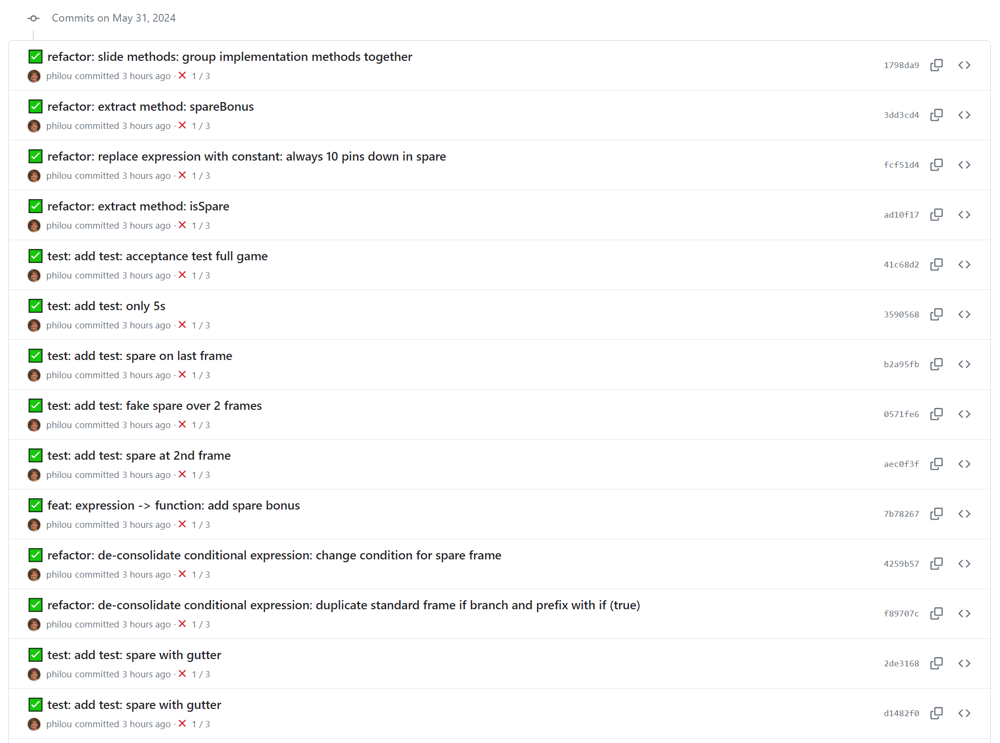

# BabyStepsGolf

 <br>
"[AI Generated Golf](https://pixabay.com/fr/illustrations/ai-g%C3%A9n%C3%A9r%C3%A9-le-golf-balle-8441650/)" by [Ray Shrewsberry](https://pixabay.com/fr/users/ray_shrewsberry-7673058/) is licenced under [Pixabay License](https://pixabay.com/fr/service/license-summary/)

## Description

_Let's see how many baby steps you need to solve this problem!_

## Getting Started

- [C++](cpp/GETTING_STARTED.md)
- [C#](csharp/GETTING_STARTED.md)
- [Elixir](elixir/GETTING_STARTED.md)
- [Go](go/GETTING_STARTED.md)
- [Java](java/GETTING_STARTED.md)
- [PHP](php/GETTING_STARTED.md)
- [Python](python/GETTING_STARTED.md)
- [Rust](rust/GETTING_STARTED.md)
- [Typescript](typescript/GETTING_STARTED.md)

## Session Quick Retrospective

You can fill it from [here](QuickRetrospective.md)

## Useful Links

### For this Kata

- Catalog of refactoring:
  - https://refactoring.com/catalog
  - https://refactoring.guru/refactoring/catalog
- Catalog of Transformations:
  - https://en.wikipedia.org/wiki/Transformation_Priority_Premise
  - original article: https://blog.cleancoder.com/uncle-bob/2013/05/27/TheTransformationPriorityPremise.html
- SPIDR Story Splitting:
  - https://www.mountaingoatsoftware.com/uploads/blog/spidr-poster.pdf
- [Make the change easy, then make the easy change](https://x.com/KentBeck/status/250733358307500032?lang=en)
- [Conventional Commits](https://www.conventionalcommits.org/en/v1.0.0/)

### General

- Collaborative timer for pairing or mobbing:
  [mobti.me](https://mobti.me/)
  or [agility timer](https://agility.jahed.dev/)

## Session Information

### Topic

_The goal of this kata is to practice updating working software with the smallest number of baby steps possible!_

### Focus Points

- Builds on TDD and TCR
- Understanding what we call a "baby step"
- Awareness that baby steps have names
- Understanding the difference between Refactoring (that preserve behaviour) and Feature (that change behaviour) baby steps.
- Learning to separate 'design' and 'feature' work
- Understand how baby-steps support continuous refactoring within user stories
- Understand how baby-steps support user story splitting that maximizes early value delivery
- "Make the change easy, then do the easy change" instead of "Making the difficult change directly"

### Style & Duration

You can practice using either of these styles:

- 2-hour [Prepared Kata](doc/PreparedKata.md)
- 2-hour [Randori in Pairs](doc/RandoriInPairs.md)
- 2-hour [Randori Kata](doc/RandoriKata.md)
- 2-hour [Mob Kata](doc/MobProgramming.md)

### Baby-steps golf

This kata should be played like a Golf track! Here are the rules of Golf that are relevant to us:

- The goal of Golf is to get the ball in the hole with the minimal number of strikes
- A Golf track consists of multiple holes
- Each hole has a known "par" which is the typical number of strikes that a player would need 

[PerlGolf](https://wiki.c2.com/?PerlGolf) is an old programming version of the Golf: the goal is to write a program with the least characters possible.

Here we are we will use another adaptation of the Golf. We will have to implement the user story with the least baby-steps possible.
Each baby step should be represented by a commit. Commits should be small and represent an elementary modification to the Abstract Syntax Tree of the program.
You can find a catalog of these transformations [here (refactoring)](https://refactoring.com/catalog) and [here (feature)](https://en.wikipedia.org/wiki/Transformation_Priority_Premise).

### TCR and tidying first

This kata comes with a custom test runner script `golf-tcr.sh`. It's an adaptation of the TCR workflow that creates baby-steps commits with custom error messages.
These messages help us to keep track of the scoring during the game 😄

TCR stands for `test && commit || revert`. Whenever you run your tests, if they pass, the code is committed, otherwise, every change is reverted.
This nudges to:

- do small changes that are safer and less of a problem when reverted
- tweak the TDD loop:
    - from `Red -> Green -> Refactor -> ...`
    - to `New test is reverted to Green -> Refactor to make the change easy -> New test is committed to green with an easy change -> ...`  

Here is a sample workflow:

1. Add (or enable, or uncomment) a test
2. run `./golf-tcr.sh test "add test" "..."`
3. If the tests pass, TCR commits and pushes with a message "✅ test: Add Test: <details>"
4. Otherwise, TCR reverts the code and the tests
   - You should have learned what is needed to pass the tests
   - _Make the change easy_: through baby-steps, prepare the code to pass the test, run `golf-tcr.sh` at every step
   - _Do the easy change_: re-enable the test, with everything ready, you should be able to make the small code changes required to pass the test
   - run `golf-tcr.sh` again
   - Depending on the tests result, Go back to 3. or 4.

Here is a sample commit log:



The facilitator will first demo what all this looks like in practice

Pairs or mobs should create a custom branch, so that the facilitator can keep track of their progress and create a leaderboard!

### golf-tcr.sh

here is how to use `golf-tcr.sh`:

```
Usage: ./golf-tcr.sh <commit type> <baby step type> <details>
  - commit type: one of: [feat refactor test fix chore docs style perf build ci revert] (cf https://www.conventionalcommits.org/en/v1.0.0/)
  - baby step type:                                                                                                                        
    - for refactorings, check: https://refactoring.com/catalog/                                                                                       
    - for features, check: see https://en.wikipedia.org/wiki/Transformation_Priority_Premise                                                              
  - details: extra info about the change
```

### It's a game! 😁

Like any game, you can cheat and cut corners... But the facilitator is looking over your shoulder! 😉

- Hiding plenty of changes in a single commit is the golf equivalent of losing your ball (in the water or outside the track).
  You'll get a penalty of 20 points! So spend the time to find the exact baby step you are using before committing.
- Don't leave the code in a mess! Otherwise, you risk disqualification! So take the time remove duplication and make the code readable

Hopefully, it will be fun!

### The Golf Track

This kata consists of 4 "holes", which are features to add to existing working software.
Each feature has a 'par': a typical number of baby steps it can be implemented with.
You might do better than the par, or worse. You can replay a hole to reduce your number of baby steps.

#### 0: Bowling Game Score (Demo)

This example is used to demo the concept of baby-steps golf to participants

- **User Story**: As a bowling shop owner, I want to add spares to my scoring algorithm, so that the players can have more fun!
- **Difficulty**: Easy
- **Par**: 7
- **Story Split by**: RULES, baby steps programming let us safely postpone more advanced rules, while letting players enjoy a working fun game early
- **Hints**:
    - Duplicate if branch

#### 1: FizzBuzz

- **User Story**: As a birthday party organizer, I want to add "Bazz" for multiples of 7, so that I have a more difficult game for experienced FizzBuzz players
- **Difficulty**: Easy
- **Par**: 10 (or 22 if we count every similar branch change separately)
- **Story Split by**: RULES, baby steps programming let us safely postpone more advanced rules, while letting players enjoy a working fun game early
- **Hints**:
  - We prepared new tests that are marked @Disabled
  - Introduce an accumulator

#### 2: Pascal Triangle

- **User Story**: As a math geek, I want to make the triangle display isosceles, so that it looks more like the traditional image we have of Pascal's Triangle
- **Difficulty**: Medium
- **Par**: 14
- **Story Split by**: INTERFACES, baby steps programming let us safely postpone improvements to the display, while letting users enjoy a working yet minimalistic display early
- **Hints**:
  - We are using the Strangler pattern to change the display while keeping everything working. "legacy" code is prefixed and marked as @Deprecated. We will need to delete it at the end.
  - Introducing 'identity' function or operations are a nice way to make code emerge

#### 3: Numbers to LCD

- **User Story**: As a giant display panel operator, I need to specify a size for the LCD display, so that I can display important information in bigger letters
- **Difficulty**: Difficult
- **Par**: 21
- **Story Split by**: DATA, baby steps programming let us safely postpone the less used cases, while letting users use a working display on the most frequent input early
- **Hints**:
  - Object method pattern
  - Encapsulate accessor

### Source Files

- [C++](cpp)
- [C#](csharp)
- [Elixir](elixir)
- [Go](go)
- [Java](java)
- [PHP](php)
- [Python](python)
- [Rust](rust)
- [Typescript](typescript)

## License

`Kata-BabyStepsGolf` and the accompanying materials are made available
under the terms of the [MIT License](LICENSE.md) which accompanies this
distribution, and is available at the [Open Source site](https://opensource.org/licenses/MIT)

## Acknowledgements

See [ACKNOWLEDGEMENTS.md](ACKNOWLEDGEMENTS.md) for more information.

## Contributors
